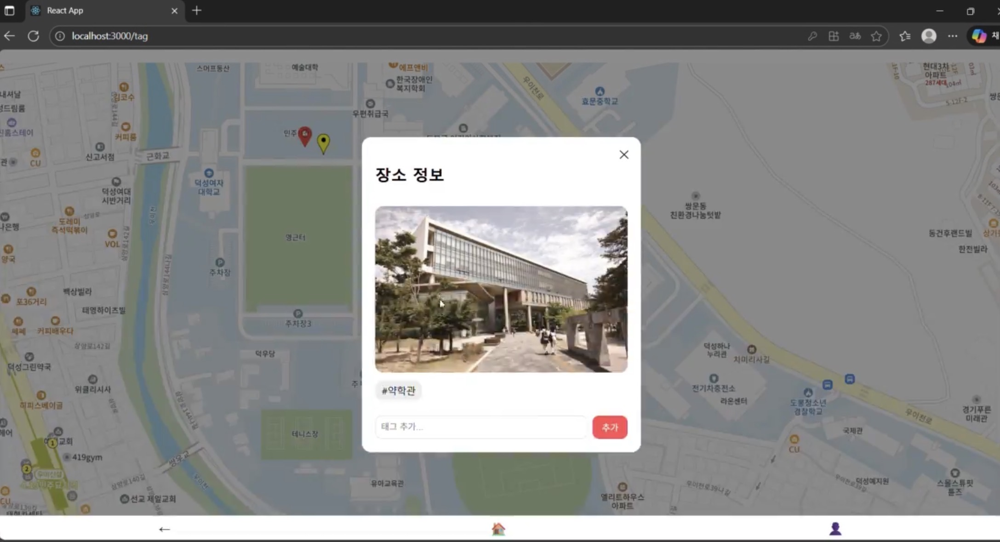

# Quiet Map

조용한 길을 선택할 수 있도록 돕는 지도 기반 웹 서비스입니다.

사용자가 특정 위치에 소음 정도를 태그로 남기고,  
다른 사용자는 해당 정보를 기반으로 더 조용한 경로를 선택할 수 있습니다.

팀 프로젝트 (프론트엔드 2인, 백엔드 2인)  
프론트엔드 개발 담당

---

## 프로젝트 개요

- 기간: 2025.11.08 ~ 2025.11.23
- 형태: 팀 프로젝트
- 역할: 프론트엔드 개발

---

## 데모 영상

https://youtu.be/vXWoEApYp0U?si=OVnWvnS5bKu0uaYB

---

## 주요 화면

### 1. 지도 화면 (핀 목록)


### 2. 핀 등록 화면


### 3. 핀 상세 확인 화면



---

## 담당 역할 (프론트엔드)

- Firebase Authentication 기반 로그인 기능 구현
- Context API를 활용한 전역 인증 상태 관리
- React Router 기반 페이지 라우팅 구조 설계
- 지도 범위에 따라 핀을 동적으로 렌더링하는 로직 구현
- 핀 등록 모달 상태 관리 및 UI 구현
- 포트폴리오용 독립 실행을 위한 환경 분기 처리

---

## 주요 구현 내용

### 1. 지도 기반 동적 렌더링

- 지도 이동 시 현재 화면 범위에 해당하는 핀만 재렌더링하도록 설계
- 기존 마커 제거 후 재생성 방식으로 지도 상태 동기화
- 소음 레벨에 따라 마커 색상을 분기하여 시각적으로 구분

### 2. 인증 상태 기반 기능 제어

- 로그인 여부에 따라 핀 등록 기능 제어
- Context API를 통해 전역 인증 상태 유지

### 3. 실행 환경 분리 설계

- 환경 변수 기반 분기 처리
- 백엔드 서버 없이도 UI 및 구조 확인 가능하도록 구성

---

## 기술 스택

React, React Router, Context API, Firebase Authentication,  
Kakao Maps API, CSS

---

## 실행 방법

```bash
npm install
npm start
```

※ 일부 기능(핀 등록, 소음 점수 계산 등)은 서버 실행이 필요합니다.
